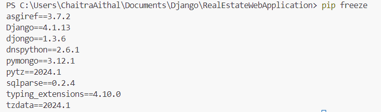

Instructions:-
Prerequisite:- Python should be installed.
1) Create a new folder 'project'
2) Download and unzip project code(RealEstateWebApplication) in the 'project' folder.
3) Download and install latest visual studio code.
4) Open visual code and click on extensions icon and install Python extensions
5) Open 'project' folder in VS.
6) Open terminal in VS and execute below commands-
    a) py -m venv myVenv
    b) myVenv\Scripts\activate.bat
    c) py -m pip install Django
    d) pip install djongo
    e) pip install pytz
    d) cd RealEstateWebApplication  (navigate into cloned code root directory)
7) Open MongoDb Compass and make sure database with name CSI5450 exists.
8) GO back to VS code terminal and execute below commands- (Location is the root of the project code where manage.py file exists.)
    a) python manage.py makemigrations
    b) python manage.py migrate
    c) python manage.py runserver

10) Click on the url http://127.0.0.1:8000/ after running the server to see website.
11) Execute the above 3 commands sequentially everytime you make any changes to any of the files.
12) execute pip freeze command to check versions of the package installed.

13) Open webapp folder located inside RealEstateWebApplication folder. This location contains files that we mostly work on. models.py, views.py and urls.py are espicially important.

14) Template folder and static folder contains html and css files.

NOTE: django looks for collections prefixed with app name. For example, if we want to insert document to home collection, django will insert to webapp_home collection. because there could be multiple apps inside main project and db properties are defined in settings.py which is common.
